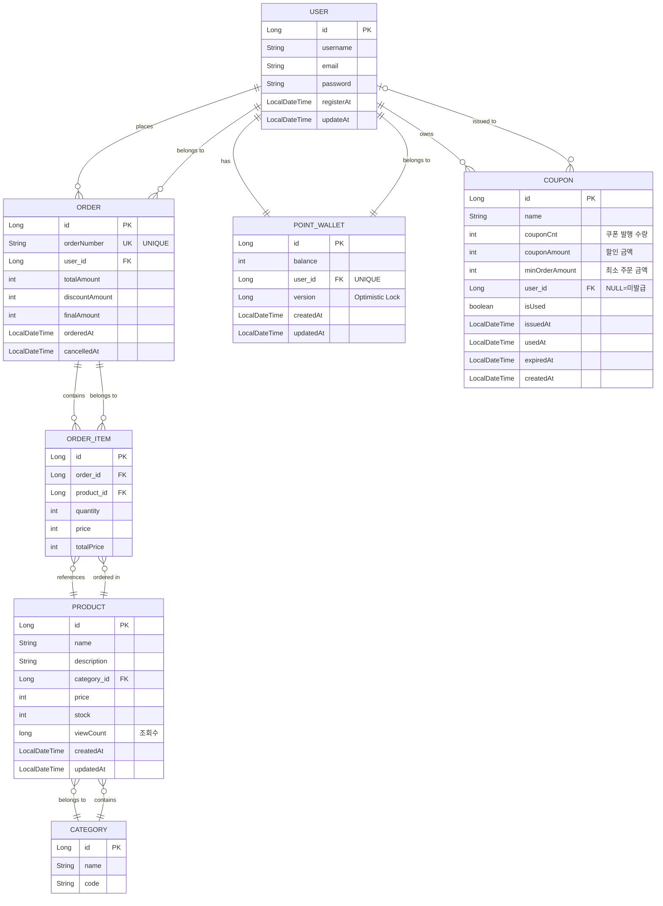

# 데이터베이스 ERD (Entity Relationship Diagram)

## ERD 다이어그램



## 엔티티 관계 설명

### 1. USER (사용자)
- **관계**
  - `1:N` → ORDER (한 사용자가 여러 주문 가능)
  - `1:1` → POINT_WALLET (한 사용자당 하나의 포인트 지갑)
  - `1:N` → COUPON (한 사용자가 여러 쿠폰 소유 가능)

### 2. POINT_WALLET (포인트 지갑)
- **관계**
  - `1:1` → USER (한 사용자당 하나의 포인트 지갑)
- **특징**
  - `version` 필드: 낙관적 락(Optimistic Lock)을 통한 동시성 제어
  - 포인트 충전, 사용, 출금 기능

### 3. ORDER (주문)
- **관계**
  - `N:1` → USER (여러 주문이 한 사용자에 속함)
  - `1:N` → ORDER_ITEM (한 주문에 여러 상품 포함)
- **특징**
  - `orderNumber`: 고유한 주문번호 (UNIQUE)
  - `totalAmount`: 총 주문 금액
  - `discountAmount`: 할인 금액 (쿠폰)
  - `finalAmount`: 최종 결제 금액 (totalAmount - discountAmount)
  - `cancelledAt`: 주문 취소 시간 (NULL이면 활성 주문)

### 4. ORDER_ITEM (주문 상품)
- **관계**
  - `N:1` → ORDER (여러 주문 상품이 한 주문에 속함)
  - `N:1` → PRODUCT (여러 주문 상품이 같은 상품 참조 가능)
- **특징**
  - 주문 시점의 상품 가격과 수량을 저장
  - `totalPrice` = `price` × `quantity`

### 5. PRODUCT (상품)
- **관계**
  - `N:1` → CATEGORY (여러 상품이 한 카테고리에 속함)
  - `1:N` → ORDER_ITEM (한 상품이 여러 주문에 포함될 수 있음)
- **특징**
  - `stock`: 재고 수량
  - `viewCount`: 조회수 (인기 상품 순위 계산에 사용)
  - 재고 관리 (차감/적재) 기능

### 6. CATEGORY (카테고리)
- **관계**
  - `1:N` → PRODUCT (한 카테고리에 여러 상품 포함)

### 7. COUPON (쿠폰)
- **관계**
  - `N:1` → USER (여러 쿠폰이 한 사용자에게 발급됨)
- **특징**
  - `user_id`가 NULL이면 미발급 쿠폰
  - 선착순 쿠폰 발급: 비관적 락(Pessimistic Lock) 사용
  - `couponCnt`: 쿠폰 발행 총 수량
  - `minOrderAmount`: 쿠폰 사용을 위한 최소 주문 금액
  - `isUsed`: 쿠폰 사용 여부
  - `expiredAt`: 쿠폰 만료 시간

## 주요 비즈니스 로직

### 1. 조회수 기반 인기 상품
- **기능**: `Product.viewCount`를 기반으로 인기 상품 순위 계산
- **API**: `GET /api/products/top?limit=10`

### 2. 판매량 기반 인기 상품
- **기능**: 최근 7일간 `ORDER_ITEM.quantity` 합계로 순위 계산
- **API**: `GET /api/products/top/sales?limit=10`
- **쿼리**: OrderItem과 Order를 JOIN하여 집계

### 3. 선착순 쿠폰 발급
- **기능**: 동일한 이름의 쿠폰 중 미발급 상태인 것을 선착순으로 발급
- **동시성 제어**: 비관적 락 (`PESSIMISTIC_WRITE`)
- **Repository**: `findFirstUnissuedCouponByNameWithLock()`

### 4. 포인트 시스템
- **기능**: 충전, 사용, 출금, 잔액 조회
- **동시성 제어**: 낙관적 락 (`@Version`)
- **검증**: 잔액 부족 시 예외 발생

### 5. 주문 시스템
- **기능**: 주문 생성, 조회, 취소
- **금액 계산**:
  - `totalAmount` = 모든 OrderItem의 totalPrice 합계
  - `finalAmount` = `totalAmount` - `discountAmount`

## 인덱스 권장사항

성능 최적화를 위한 인덱스:

```sql
-- Order 조회 최적화
CREATE INDEX idx_order_number ON ORDER(orderNumber);
CREATE INDEX idx_order_user_id ON ORDER(user_id);
CREATE INDEX idx_order_ordered_at ON ORDER(orderedAt);

-- Product 인기 상품 조회 최적화
CREATE INDEX idx_product_view_count ON PRODUCT(viewCount DESC);
CREATE INDEX idx_product_category_id ON PRODUCT(category_id);

-- Coupon 선착순 발급 최적화
CREATE INDEX idx_coupon_name_user_id ON COUPON(name, user_id);
CREATE INDEX idx_coupon_expired_at ON COUPON(expiredAt);

-- OrderItem 판매량 집계 최적화
CREATE INDEX idx_order_item_product_id ON ORDER_ITEM(product_id);
CREATE INDEX idx_order_item_order_id ON ORDER_ITEM(order_id);
```

## 제약조건

### UNIQUE 제약조건
- `ORDER.orderNumber`: 주문번호 중복 방지
- `POINT_WALLET.user_id`: 사용자당 하나의 포인트 지갑

### NOT NULL 제약조건
- 모든 PK, FK
- `PRODUCT.price`, `PRODUCT.stock`, `PRODUCT.viewCount`
- `ORDER.totalAmount`, `ORDER.discountAmount`, `ORDER.finalAmount`
- `COUPON.couponAmount`, `COUPON.minOrderAmount`, `COUPON.isUsed`

### CHECK 제약조건 (애플리케이션 레벨)
- `PRODUCT.stock >= 0`
- `POINT_WALLET.balance >= 0`
- `ORDER.totalAmount >= 0`
- `COUPON.couponAmount > 0`
- `COUPON.minOrderAmount >= 0`

---

**생성일**: 2025-11-06
**버전**: 1.0
